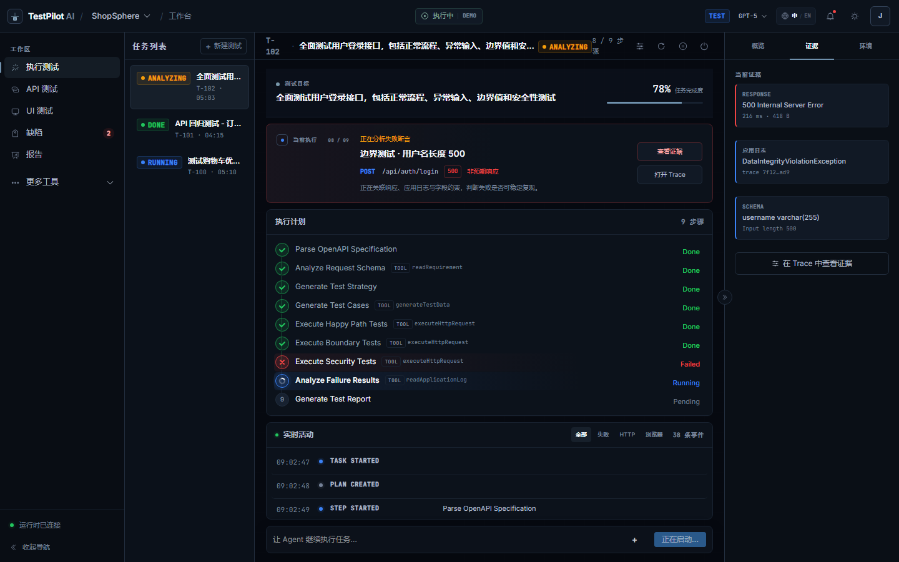

# TestPilot AI

**AI 智能软件测试与缺陷分析平台**

[](https://github.com/yuzhou602/testpilot-ai/actions/workflows/ci.yml)
[](frontend/package.json)
[](backend/pom.xml)
[](docs/DEMO_GUIDE.md)

TestPilot AI 是一个面向 QA 与研发团队的 AI Agent 测试平台。用户只需描述测试目标，Agent 即可生成测试计划、调用 API 或浏览器工具执行测试、分析失败、关联证据，并输出缺陷与测试报告。

它的重点不是“用 AI 聊天管理测试”，而是让 Agent 的每一步执行、工具调用、失败分析和证据来源都可观察、可追踪。



## 项目亮点

- **Agent First**：默认首页是实时测试工作台，而不是 KPI Dashboard。
- **Execution Visible**：计划、步骤、工具调用、断言和失败分析持续显示在 Activity Stream 中。
- **Evidence First**：失败结果关联 HTTP 响应、应用日志、Schema 与截图，不只显示一条错误信息。
- **Traceable AI**：Agent Trace 展示任务理解、决策、工具和输出；AI 推测与已观察事实明确区分。
- **Locator Self-Healing**：展示原 Locator、候选 Locator、置信度、证据与恢复决策。
- **Showcase Ready**：默认提供确定性的 ShopSphere 演示数据，无需数据库、模型 API 或测试账号即可浏览完整流程。
- **中英文界面**：支持 `中 / EN` 即时切换，并保存语言偏好。
- **响应式开发者工具布局**：1440px 三栏工作区；1200px 收缩导航；1024px 保持核心执行能力；移动端用于查看任务和报告。

## 3 分钟体验

```bash
cd frontend
npm install
npm run dev
```

打开 [http://localhost:5173/login?lang=zh](http://localhost:5173/login?lang=zh)，点击“进入产品演示”。系统会进入 ShopSphere 示例项目并自动打开产品导览。

默认配置：

```dotenv
VITE_DEMO_MODE=true
VITE_AUTH_REQUIRED=false
```

演示模式完全在前端运行；后端不可用不会阻塞展示。

详细步骤见 [演示指南](docs/DEMO_GUIDE.md)。

项目仓库：[github.com/yuzhou602/testpilot-ai](https://github.com/yuzhou602/testpilot-ai)

## 核心工作流

```text
描述测试目标
    ↓
理解需求与可用测试来源
    ↓
生成测试策略和执行计划
    ↓
调用 HTTP / Browser / Log / Database 等工具
    ↓
执行断言并捕获失败
    ↓
关联 Response + Log + Schema + Screenshot
    ↓
形成明确标注的 AI Hypothesis
    ↓
生成 Evidence-Based Bug 与 Test Report
```

## 页面与展示重点

| 页面 | 路由 | 展示重点 |
|---|---|---|
| Login | `/login` | 产品定位、一键进入演示 |
| AI Test Workspace | `/workspace` | Goal、Plan、Activity、当前失败、证据上下文 |
| API Testing | `/api-testing` | API Tree、Request、Response、Assertion、AI 补测建议 |
| UI Testing | `/ui-testing` | Browser Preview、Test Steps、Locator Inspector、Self-Healing |
| Requirements | `/requirements` | 业务规则、覆盖率、边界缺口与补测建议 |
| Test Cases | `/test-cases` | 可执行测试资产、风险、自动化状态与最近结果 |
| Bug Center | `/bugs` | Fact、Evidence、AI Hypothesis、复现可信度 |
| Reports | `/reports` | 测试范围、风险、覆盖缺口与下一步建议 |
| Agent Trace | `/trace/102` | Agent 决策链、工具调用、耗时、Token 与失败路径 |
| AI Evaluation | `/evaluation` | Agent 版本对比、质量门禁和发布结论 |
| Settings | `/settings` | 环境、Agent 权限、模型路由和证据策略 |

## 技术架构



架构图提供 [Mermaid 源文件](docs/diagrams/testpilot-architecture.mmd)、[SVG](docs/diagrams/testpilot-architecture.svg)、[PNG](docs/diagrams/testpilot-architecture.png) 与 [可编辑 Excalidraw 文件](docs/diagrams/testpilot-architecture.excalidraw)，方便在简历、答辩和演示材料中复用。

### 前端

- Vue 3.5 + Composition API
- TypeScript 5.6
- Vite 5
- Pinia
- Vue Router
- Element Plus（二次主题设计）
- Tailwind CSS
- Vue Flow（Agent Trace）
- vue-i18n
- Axios + SSE

### 后端

- Java 21
- Spring Boot 3.3
- Spring AI
- Spring Security + JWT
- Spring Web MVC / WebFlux SSE
- Spring Data JPA
- MySQL 8 + Redis
- PostgreSQL / PGVector
- Playwright Java
- Swagger Parser / SpringDoc

更完整的模块边界、运行模式和数据流见 [架构说明](docs/ARCHITECTURE.md)。REST 与 SSE 接口见 [API 参考](docs/API.md)。

## 两种运行模式

### 展示模式（默认）

展示模式适合简历、作品集和现场演示：

- 使用内置 ShopSphere 数据；
- 不要求后端、MySQL、Redis 或 LLM Key；
- 支持模拟 Agent 实时执行、暂停、重放与失败分析；
- 所有主要页面都有可展示内容；
- 新建项目和设置保存在当前浏览器状态。

### 联调模式

将 `frontend/.env.example` 复制为 `frontend/.env.local`，修改：

```dotenv
VITE_DEMO_MODE=false
VITE_AUTH_REQUIRED=true
```

前端会优先调用真实 REST API，并通过 SSE 接收 Agent 事件；请求失败时，部分页面仍会使用演示数据作为可视化回退。

## 启动完整环境

### 前置条件

- Java 21+
- Maven 3.9+
- Node.js 20+（Dockerfile 使用 Node 20）
- MySQL 8
- Redis 7
- 可选：OpenAI-compatible 模型服务

### 本地启动

1. 根据 `.env.example` 配置数据库、Redis、JWT 和模型变量。

2. 启动后端：

   ```bash
   cd backend
   mvn spring-boot:run
   ```

   Windows PowerShell：

   ```powershell
   cd backend
   mvn spring-boot:run
   ```

3. 启动前端：

   ```bash
   cd frontend
   npm install
   npm run dev
   ```

4. 打开 `http://localhost:5173`。后端默认监听 `http://localhost:8080`。

### Docker Compose

在项目根目录执行：

```bash
docker compose up --build
```

服务地址：

| 服务 | 地址 |
|---|---|
| Frontend | `http://localhost:3000` |
| Backend | `http://localhost:8080` |
| MySQL | `localhost:3306` |
| Redis | `localhost:6379` |

## 验证

前端生产构建：

```bash
cd frontend
npm run build
```

核心路由浏览器冒烟测试：

```bash
npm run test:smoke
```

冒烟测试会启动临时 Vite 服务，使用本机 Chrome/Edge 以 1440×900 渲染 10 条核心路由，并检查截图是否成功生成。

后端测试：

```bash
cd backend
mvn test
```

## 项目结构

```text
TestPilot AI/
├─ frontend/
│  ├─ src/views/              # 业务页面
│  ├─ src/components/agent/   # Agent Plan / Activity / Composer
│  ├─ src/components/common/  # 状态、证据、导览等通用组件
│  ├─ src/stores/             # Pinia 与演示执行状态
│  ├─ src/data/demo.ts        # 确定性展示数据
│  ├─ src/locales/            # 中英文语言资源
│  └─ scripts/smoke.mjs       # 核心路由浏览器测试
├─ backend/
│  └─ src/main/java/com/testpilot/
│     ├─ agent/               # Planner、Runtime、Tools、Trace、Evaluation
│     ├─ api/                 # OpenAPI 导入
│     ├─ auth/                # JWT 认证
│     ├─ requirement/         # 需求与规则
│     ├─ testcase/            # 测试用例
│     ├─ bug/                 # 缺陷
│     └─ report/              # 测试报告
├─ docs/                      # 架构、API 与演示文档
└─ docker-compose.yml
```

## 当前边界

该项目定位为作品展示与技术验证，并非生产级商业测试平台。当前应明确区分：

- UI Testing 页面完整展示 Self-Healing 决策链；真实浏览器执行需要连接后端 Playwright Tool。
- 模型评测页展示可解释的版本对比和质量门禁；演示数据不是实际模型 Benchmark 结果。
- AI 根因内容始终标注为 Hypothesis，不能替代代码检查或人工确认。
- 默认 `.env.example` 只包含占位配置；部署前必须替换 JWT、数据库和模型凭据。
- 暂未覆盖生产级多租户、计费、审计合规和大规模并发调度。

## 文档

- [演示指南](docs/DEMO_GUIDE.md)：3–5 分钟现场讲解路线与故障处理。
- [面试讲解稿](docs/INTERVIEW_SCRIPT.md)：3 分钟口述稿、1 分钟压缩版与高频追问。
- [架构说明](docs/ARCHITECTURE.md)：前后端模块、Agent 数据流、运行模式与设计取舍。
- [API 参考](docs/API.md)：REST 与 SSE 接口。
- [贡献指南](CONTRIBUTING.md)：开发规范和提交流程。
- [变更记录](CHANGELOG.md)：版本变化。

## License

MIT
